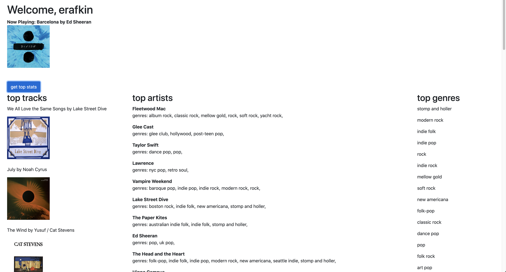

# a web app playing around with the spotify api

this is a full stack web app built with react and node/express that accesses the [spotify api](https://developer.spotify.com/documentation/). 
uses [passport-spotify](http://www.passportjs.org/packages/passport-spotify/) to expedite the auth process.

## run
to use clone this repo, cd into both the front and back ends and run `yarn install`
you will need to set up your own [mongo](https://www.mongodb.com/) database and provide its URI.
you will need to authorize your spotify developer account and get a client id and client secret. all three of these variables go into your `.env` file on the backend as follows:
```
CLIENT_ID={your_client_id}
CLIENT_SECRET={your_client_secret}
SECRET={any_secret_string}
MONGO_URI={your_mongo_uri}
```
## features
- spotify auth (gets account info such as username)
- now playing (if you are playing something)
- current top artists (medium term)
- current top tracks (medium term)
- current top genres (pulled from medium term top artists)

am i embarrassed that glee cast is my current number 2 artist? no.

